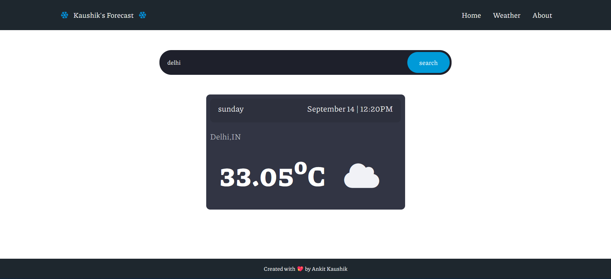

# Weather App using Node

#

You can see from the above demo that this web app can search for any city's temperature using just the city's name. The temperature is given in celsius. I used openweatherapi in this project, without node, express, hbs, etc., this app would not have been possible. 

Website Link - https://akmovies-ak.web.app/

Developed by Ankit Kaushik! Enjoy! :D
